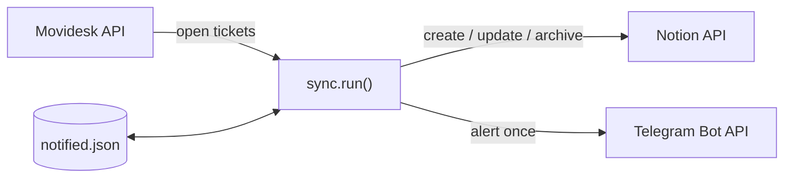

# Movidesk → Notion sync

A Python job that keeps a **Notion database in step with the Movidesk help-desk** and raises
**Telegram alerts** for tickets that need attention. Built to remove manual copy-paste from a
real IT support workflow.

## What it does, each run

1. Pull every open ticket (`Novo`, `Em atendimento`) from **Movidesk**, paging through all results.
2. For a ticket that has an **assignee and a linked asset** → create or update its **Notion**
   page (title, number, requester, assignee, equipment, status, description).
3. For a ticket that is **unassigned, has no asset, and matches a keyword**
   (notebook, meeting room, microphone, …) → send a **Telegram** message, once.
4. **Archive** Notion pages whose ticket has been closed or has left Movidesk, so the board
   stays clean.

Sent alerts are remembered in a small JSON file so nobody gets pinged twice.



## Layout

```
movidesk_notion/
  config.py        settings from env + keyword list + validation
  http_client.py   requests.Session with retry + backoff (429/5xx)
  movidesk.py      fetch_open_tickets()
  notion.py        NotionClient: index_by_ticket / create / update / archive
  telegram.py      Telegram.send()
  state.py         NotifiedStore — the "already alerted" file
  tickets.py       pure helpers: parse, keyword match, build properties & messages
  sync.py          run(): the orchestration (I/O is injected, so it's testable)
main.py            CLI: --dry-run, --state-file, --verbose
tests/             13 tests, no network
```

## Run

```bash
python -m venv .venv && source .venv/bin/activate
pip install -r requirements.txt
cp .env.example .env      # fill in the tokens

python main.py            # one sync
python main.py --dry-run  # log what would change, write nothing
```

Schedule it (cron / Task Scheduler) to keep the board live. Config — including the keyword
list (`KEYWORDS`) — is all environment variables; see `.env.example`.

## Tests

```bash
pip install -r requirements-dev.txt
pytest
```

`sync.run()` takes its Notion / Telegram / state dependencies as arguments, so the tests drive
it with fakes and assert the create / update / archive / alert behaviour without touching the
network.
